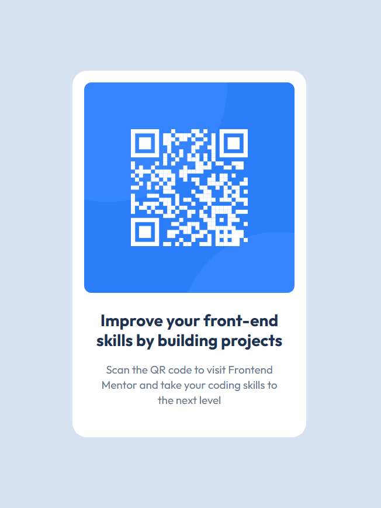

# Frontend Mentor - Recipe page solution

This is a solution to the [QR code component challenge on Frontend Mentor](https://www.frontendmentor.io/challenges/qr-code-component-iux_sIO_H). Frontend Mentor challenges help you improve your coding skills by building realistic projects. 

### Screenshots

### Links

- Solution URL: https://www.frontendmentor.io/solutions/qr-code-card-3AU1vLJibW
- Live Site URL: https://mzdemir-qr-code-component.netlify.app/

## My process

### Built with

- Semantic HTML5 markup
- Vanilla CSS 

## Author

- Website - https://github.com/mzdemir
- Frontend Mentor - https://www.frontendmentor.io/profile/mzdemir
